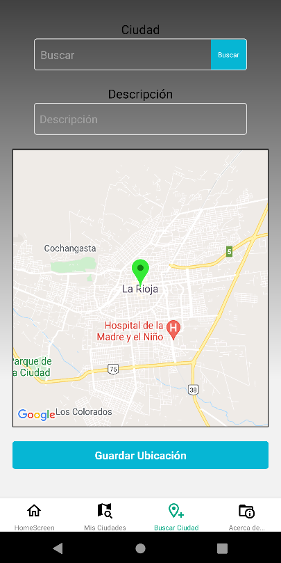
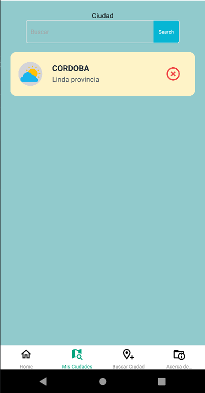
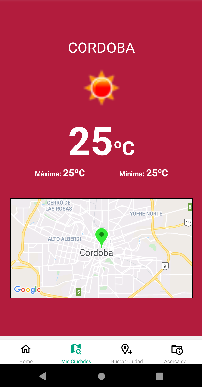
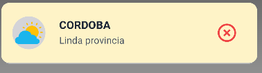

  

<h1 align="center">Delivery Ice Cream App</h3>

[]

---

 Unas cuantas lineas que describen el proyecto.
     

## 📝 Tabla de Contenidos

- [Ideas / Solución](#idea)
- [Dependencias](#dependencias)
- [Como se usa](#usar)
- [Tecnologías usadas](#tec)
- [Autores](#autores)
- [Conocimientos](#Conocimientos)

## 💡 Ideas / Solución 

Paula es vendedora de helados. Inicialmente, comenzó a vender helados a nivel local en una playa
ubicada a 1 hora de la ciudad.

¡Después de 10 años de ventas, su negocio prosperó y finalmente pudo expandirlo! Con un helado muy
famoso, hoy vende helados en 10 playas de la costa.
Para cubrir la demanda y gestionar su producción correctamente Paula necesita estar al tanto de un
elemento que hasta entonces no le había preocupado: El clima.
Con tantos sitios diferentes para venderlos ¿Puede considerar el mismo clima? Hay días que llueve en
algunos sitios… ¡Hay otros en los que hace sol todo el tiempo! ¿Cómo ayudar a Paula?

En ese proyecto, deberás generar una aplicación que consuma un servicio del clima y permita agregar
ciudades a un listado. Esta información deberá ser visualizada en un mapa. Cuando el usuario seleccione
una ciudad se deberá desplegar la temperatura del lugar.

## ⛓️ Dependencias 

- [@react-native-async-storage/async-storage: ~1.15.0]()
- [@react-navigation/bottom-tabs: ^6.0.9]()
- [@react-navigation/native: ^6.0.6]()
- [@react-navigation/stack: ^6.0.11]()
- [axios: ^0.24.0]()
- [expo: ~43.0.2]()
- [expo-linear-gradient: ~10.0.3]()
- [expo-status-bar: ~1.1.0]()
- [firebase: ^9.5.0]()
- [lottie-react-native: 4.0.3]()
- [native-base: ^3.2.2]()
- [react: 17.0.1]()
- [react-dom: 17.0.1]()
- [react-native: 0.64.3]()
- [react-native-gesture-handler: ~1.10.2]()
- [react-native-maps: 0.28.1]()
- [react-native-safe-area-context: 3.3.2]()
- [react-native-screens: ~3.8.0]()
- [react-native-svg: 12.1.1]()
- [react-native-web: 0.17.1]()
- [swr-firestore-v9: ^1.0.]()

## 🎈 Como se usa 

Su uso es muy sencillo, para poder agregar la ciudad que es de tu agrado tienes que ir a la pantalla de buscar ciudad.
En la casilla de ciudad debes colocar una ciudad y presionar el botón buscar. Una vez encontrada la ciudad aparecerá en el mapa que se encuentra debajo.

</a>

  Luego agregar una corta descripción de la ciudad y para guardar en nuestra lista presiona guardar ubicación.
 !Listo tu ciudad quedó guardada!

  Luego en la pantalla de mis ciudades puedes buscar una ciudad para poder ver su clima.
  En la casilla ciudad a buscar introduce la ciudad y presionas el botón de buscar. De existir la ciudad aparecerá en la pantalla.

</a>

  Luego puedes presionar en la ciudad y te llevará a la pantalla de clima donde podrás ver la temperatura actual, máxima y mínima.

</a>

  También podrás borrar una ciudad si lo deseas con sólo presionar el pulsador con la X en rojo.

</a>

 

## ⛏️ Tecnologías Usadas 

- [React Native]() - Mobile Framework
- [Firebase]() - Database NoSQL
- [React Navigation]() - Librería para React Native
- [Native Base]() - Librería para diseño UI

## ✍️ Autores 

- [Alejandro Silvestro]()
- [Gabriel Tarifa]()
- [Marcela Rozek]()

